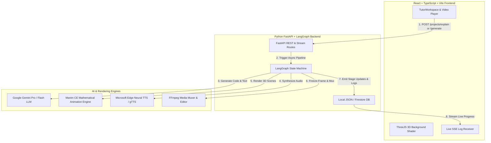
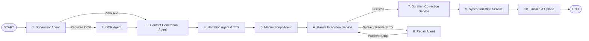
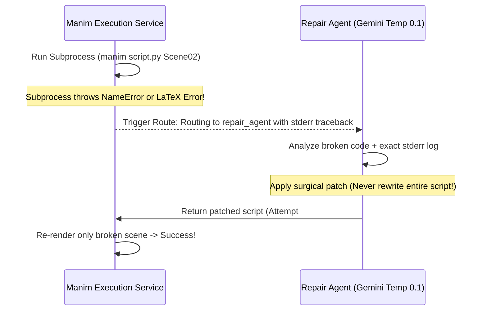

# 🎓 EduVideo / MathTutor AI: The Complete Architecture & Deep-Dive Explanation

Welcome to the comprehensive technical and intuitive guide to **EduVideo (MathTutor AI)** — an advanced, autonomous AI platform that converts abstract scientific topics, textbooks, PDFs, and mathematical questions into high-definition, lip-synced 3D animated video lessons.

---

## 🌟 1. The Big Picture (Intuitive Overview for Non-Technical Readers)

Imagine you want to explain a complex physics concept like **Einstein's Theory of Relativity** or solve a tricky algebra equation like $2x + 5 = 15$. 

Normally, producing a 3D animated educational video requires an entire production studio:
1. A **Screenwriter** to break the topic into an engaging lesson plan and storyboard.
2. A **Voice Actor** to narrate the lesson clearly.
3. A **3D Mathematical VFX Animator** to write code or keyframe complex graphs and geometries.
4. A **Quality Control Inspector** to catch visual bugs or syntax errors.
5. A **Video Editor** to cut, trim, and synchronize the animations with the voiceover.

**EduVideo automates this entire Hollywood studio using Artificial Intelligence.**
When you type a topic or upload a PDF/image, our system spawns an autonomous team of AI agents governed by a **LangGraph State Machine**. Each agent performs its job sequentially, communicating via a shared memory state, automatically repairing its own errors, and delivering a finalized MP4 video directly to your browser—all in real time!

---

## 🏗️ 2. High-Level System Architecture & Tech Stack

The project is divided into two modern, decoupled layers communicating via REST APIs and real-time Server-Sent Events (SSE):



### 💻 Tech Stack Glossary:
*   **Frontend**: Built with **React 18**, **TypeScript**, **Vite**, and **Tailwind CSS**. It features `@tanstack/react-query` for state management and an interactive 3D particle background rendered using **Three.js** and WebGL shaders.
*   **Backend**: Built with **Python 3.10+** and **FastAPI**, providing asynchronous REST endpoints and real-time Server-Sent Events (`/api/v1/jobs/{id}/stream`).
*   **Orchestration Engine**: **LangGraph** — a directed acyclic graph (DAG) framework that manages multi-agent workflows, checkpointing, and conditional routing.
*   **Intelligence Engine**: **Google Gemini Pro & Flash** — used for document analysis, instructional design, python code generation, and traceback error repair.

---

## 🧠 3. The LangGraph AI Pipeline (The Nervous System)

At the heart of the backend is the `video_generation_graph` (defined in `app/graph/builder.py`). Instead of a simple linear script, the pipeline is a resilient **State Machine** where each node represents a specialized AI agent or rendering service:



### Step-by-Step Agent Walkthrough:

1.  **Supervisor Agent (`supervisor_node`)**:
    *   *What it does*: Validates user input and determines routing flags. If you upload a handwritten note, PDF textbook, or image, it routes to the OCR Agent. If you input a plain topic (e.g., "Explain Calculus"), it routes directly to Content Generation.
2.  **OCR Agent (`ocr_agent_node`)**:
    *   *What it does*: Extracts clean text, equations, and structured data from documents. It uses **PyMuPDF** for digital PDFs and optical character recognition (**Tesseract** / **EasyOCR**) for images and handwriting.
3.  **Content Generation Agent (`content_generation_node`)**:
    *   *What it does*: Acts as the instructional designer. It prompts Gemini to generate a structured `LessonPlan` and `Storyboard`. The storyboard breaks the topic into discrete scenes (e.g., `Scene 01: Intro`, `Scene 02: Visualizing the Graph`), defining the exact narration script and visual layout for each.
4.  **Narration Agent (`narration_agent_node`)**:
    *   *What it does*: Converts the textual narration scripts from the storyboard into professional voiceovers using **Microsoft Edge Neural TTS** (`edge-tts`). Crucially, it measures the exact acoustic duration (in milliseconds) of each generated audio file using audio analysis libraries (`mutagen` / `pydub`).

---

## 🎨 4. Deep-Dive: The Manim CE 3D Animation Engine (The Core Engine)

This is the most technically sophisticated part of the EduVideo platform. How do we turn conversational text into frame-accurate mathematical animations?

### What is Manim CE?
**Manim (Mathematical Animation Engine)** is an open-source Python library originally created by 3Blue1Brown (Grant Sanderson) and maintained by the Community Edition (CE) team. Unlike traditional 3D animation software (like Blender or Maya) where artists drag and drop objects with a mouse, Manim creates animations **programmatically through code**. You write Python classes that define geometric shapes, LaTeX equations, coordinate axes, and camera transformations (e.g., `self.play(Write(equation), run_time=2)`).

---

### 🔥 Masterclass Architectural Feature #1: Audio-Driven Animation Timing
In most AI video generators, animation code is generated independently of audio, leading to videos where the narrator is still talking while the animation has already finished (or vice versa). 

**EduVideo solves this through an "Audio-First" feedback loop:**
1. Notice in our graph topology that **Narration Agent runs BEFORE Manim Script Agent**.
2. When `NarrationAgent` synthesizes the MP3 voiceovers, it stores the exact measured durations (e.g., Scene 01 = 4.82 seconds, Scene 02 = 12.45 seconds) inside the LangGraph state variable `state["scene_audios"]`.
3. When `ManimScriptAgent` runs, it dynamically injects these **real audio durations** into Gemini's system prompt! 
4. Gemini is instructed to calculate its animation wait times (`self.wait(...)`) and animation run times (`run_time=...`) so that the total mathematical animation time for `Scene01` equals exactly 4.82 seconds!

---

### 🔥 Masterclass Architectural Feature #2: Per-Scene Isolated Rendering
Imagine you ask the AI to generate a 3-minute video with 6 complex scenes. If the AI generated a single giant Python class (`CombinedVideoScene`) and rendered it as one monolithic file:
*   If a minor syntax error occurred in Scene 05, the entire 3-minute video would fail to render!
*   You would waste massive amounts of CPU/GPU rendering time re-computing scenes that already worked.

**How EduVideo executes cleanly (`manim_execution_service.py`):**
Instead of rendering one massive video, our execution service parses the Python script using AST/regex, isolates each individual `Scene` subclass (`Scene01`, `Scene02`, `Scene03`), and launches **separate Python subprocesses** for each scene:
```bash
manim -ql -v WARNING manim_script.py Scene01 --media_dir ./renders
manim -ql -v WARNING manim_script.py Scene02 --media_dir ./renders
```
This produces individual raw video clips (`scene_01_raw.mp4`, `scene_02_raw.mp4`). If `Scene02` succeeds but `Scene03` fails, the system preserves `Scene02` and knows exactly which class is broken!

---

### 🔥 Masterclass Architectural Feature #3: Self-Healing Code (`RepairAgent`)
When an AI model generates complex mathematical code, syntax errors, missing LaTeX imports, or overlapping geometry errors can occur. EduVideo features an autonomous self-healing loop:



*   **Surgical Precision**: The `RepairAgent` is configured with an ultra-low temperature (`temperature=0.1`) for maximum determinism. It is strictly instructed never to rewrite the whole file—only to patch the exact line causing the traceback.
*   **Bounded Retries**: The state machine allows up to 3 automatic repair iterations (`max_repair_retries = 3`) before gracefully falling back or terminating, preventing infinite loops.

---

### 🔥 Masterclass Architectural Feature #4: Millisecond Synchronization & Freeze-Framing
Even when Gemini tries to match the audio duration, programmatic rendering can sometimes finish a fraction of a second too early or too late. The `DurationCorrectionService` and `SynchronizationService` guarantee 100% audio-visual alignment using **FFmpeg**:

1.  **Freeze-Frame Padding**: If `Scene01` audio is 5.0 seconds long, but the Manim animation finishes rendering at 4.6 seconds, our service uses FFmpeg to clone and hold the **very last frame** of the video for the remaining 0.4 seconds (`tpad=stop_mode=clone`). The visual remains smoothly on screen while the narrator finishes speaking!
2.  **Surgical Trimming**: If the animation is slightly longer than the audio, it trims the trailing frames.
3.  **Muxing & Concatenation**: Finally, `SynchronizationService` muxes each corrected MP4 scene with its matching MP3 audio track, and concatenates all scenes (`concat demuxer`) into the unified `final_video.mp4`.

---

## 💬 5. Real-Time UX & Interactive Chatbot Tutor

While your 3D video is being compiled in the background (which can take 30 to 60 seconds depending on complexity), the frontend keeps you fully engaged:

1.  **Live Terminal SSE Streaming**: Notice the terminal log box at the bottom of the workspace. As `generation.py` streams events from LangGraph, it writes progress updates (`update_stage` and `append_log`) to our database repository. The frontend receives these over Server-Sent Events (`/api/v1/jobs/{id}/stream`) and auto-scrolls the terminal in real time.
2.  **GPT-4 Style Chatbot Problem Solving**: When you ask a question like `2+2 = ?` or `Solve x^2 - 4 = 0` in the chat workspace, the `/projects/explain` API route invokes Gemini configured as an expert AI tutor. It immediately solves your equation step-by-step with LaTeX formatting and clean explanations, while simultaneously initializing a 3D animation lesson to visualize the math in the video player!
3.  **Persistent Browser State**: Using React `localStorage` hooks, your chat history, active project IDs, and generated video players remain safely preserved even if you navigate away to the dashboard or refresh your browser. Everything stays intact until you click the **Clear** (trash icon) button.

---

## 🏆 Summary: Why This Project is Extraordinary

EduVideo represents a paradigm shift in educational content creation:
*   **For Students & Educators**: It turns dry equations and static textbook PDFs into vibrant, immersive 3D video lessons that explain concepts intuitively.
*   **For Developers & Engineers**: It demonstrates a production-grade implementation of **Agentic AI Workflow Orchestration**—combining LangGraph state machines, multi-modal LLM prompting, audio-driven duration timing, per-scene subprocess isolation, autonomous error repairing, and real-time streaming into a unified, resilient architecture.
