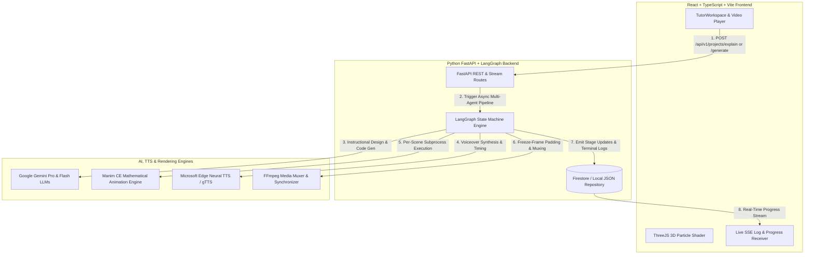
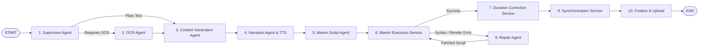

# 🎓 AetherLearn.ai / MathTutor AI
### Autonomous 3D Educational Video Generation Platform & Interactive AI Tutor


---

## 🌟 1. Executive Summary & Why This is Revolutionary

**AetherLearn.ai (MathTutor AI)** is a production-grade, autonomous artificial intelligence platform that converts abstract scientific concepts, textbook pages, PDFs, images, handwritten notes, and mathematical equations into high-definition, lip-synced 3D animated video lessons.

Normally, producing a 3D animated educational video requires an entire production studio:
1. A **Screenwriter** to break the topic into an engaging lesson plan and storyboard.
2. A **Voice Actor** to narrate the lesson clearly with natural pacing.
3. A **3D Mathematical VFX Animator** to write code or keyframe complex graphs and geometries.
4. A **Quality Control Inspector** to catch visual bugs, syntax errors, or timing misalignments.
5. A **Video Editor** to cut, trim, and synchronize the animations with the voiceover.

**AetherLearn.ai automates this entire Hollywood production studio using Artificial Intelligence.**
When a user inputs a topic or uploads a document, the system spawns an autonomous team of AI agents governed by a **LangGraph Directed Acyclic Graph (DAG) State Machine**. Each agent performs its job sequentially, communicating via shared memory state, automatically repairing its own rendering errors, and delivering a finalized, frame-synchronized MP4 video directly to the browser—all in real time!

---

## 🏗️ 2. High-Level System Architecture & Tech Stack

The platform is designed with a decoupled architecture communicating via asynchronous REST APIs and real-time Server-Sent Events (SSE):



### 💻 Technology Stack Glossary
*   **Frontend**: Built with **React 18/19**, **TypeScript**, **Vite**, and **Tailwind CSS**. Features `@tanstack/react-query` for server state caching, persistent `localStorage` session retention, and an interactive 3D particle background rendered via **Three.js** and WebGL shaders.
*   **Backend**: Built with **Python 3.11+** and **FastAPI**, providing asynchronous REST endpoints and real-time Server-Sent Events (`/api/v1/jobs/{id}/stream`).
*   **Orchestration Engine**: **LangGraph** — manages stateful multi-agent workflows, checkpointing, conditional routing, and bounded error recovery.
*   **Intelligence Engine**: **Google Gemini Pro & Flash** — utilized for multi-modal document analysis, instructional design, programmatic Python code generation, and surgical traceback error repair.
*   **Rendering & Media Engines**: **Manim CE** (Mathematical Animation Engine), **Microsoft Edge Neural TTS**, and **FFmpeg**.
*   **Storage & Persistence**: Flexible repository design supporting **Firebase Firestore & Cloud Storage** for production cloud deployments, with automatic fallback to **Thread-Safe Local JSON files & Local File Storage** for zero-dependency local development.

---

## 🧠 3. Multi-Agent LangGraph Pipeline (The Nervous System)

At the core of the backend is the `video_generation_graph` (defined in [builder.py](file:///d:/MathTutor/backend/app/graph/builder.py)). Rather than a linear script, the generation workflow is a resilient **State Machine** where each node represents a specialized AI agent or deterministic rendering service:



### Step-by-Step Pipeline Workflow:
1.  **Supervisor Agent (`supervisor_node`)**: Evaluates user inputs and determines routing flags. Multi-modal document uploads (PDFs, images, handwriting) route to the OCR Agent; plain text topics route directly to Content Generation.
2.  **OCR Agent (`ocr_agent_node`)**: Extracts clean text, LaTeX equations, and structural data using **PyMuPDF** for digital documents and **Tesseract / EasyOCR** for images and handwriting.
3.  **Content Generation Agent (`content_generation_node`)**: Acts as the instructional designer. Uses Gemini 1.5 Pro to generate a structured `LessonPlan` and `Storyboard`, breaking the lesson into discrete scenes (e.g., `Scene 01: Intro`, `Scene 02: Visualizing the Graph`) with defined narration scripts and visual layouts.
4.  **Narration Agent (`narration_agent_node`)**: Synthesizes natural, teacher-like voiceovers using **Microsoft Edge Neural TTS** (`edge-tts`). Crucially, it measures the exact acoustic duration (in milliseconds) of each synthesized audio file using audio analysis libraries (`mutagen` / `pydub`).
5.  **Manim Script Agent (`manim_script_agent_node`)**: Prompts Gemini 1.5 Pro to generate valid programmatic Python code for Manim CE. It dynamically injects the exact audio durations measured in Step 4 into the prompt so the animation timing matches the spoken narration.
6.  **Manim Execution Service (`manim_execution_service`)**: Executes Manim rendering in isolated subprocesses for each scene class.
7.  **Repair Agent (`repair_agent_node`)**: If a subprocess fails, this low-temperature AI agent analyzes the exact `stderr` traceback and applies a surgical 1-line code patch.
8.  **Duration Correction & Synchronization Service (`duration_correction_service` & `synchronization_service`)**: Uses FFmpeg to apply freeze-frame padding, trim trailing frames, mux audio/video tracks, and concatenate all scenes into the final MP4 video.

---

## 🔥 4. Masterclass Architectural Innovations

### Innovation #1: Audio-Driven Animation Timing
In conventional AI video generators, animation scripts are generated independently of audio, resulting in severe desynchronization where the narrator is talking while the animation has already finished (or vice versa). 
*   **Our Solution**: The **Narration Agent runs before the Manim Script Agent**. When `NarrationAgent` generates the MP3 voiceovers, it stores the exact measured durations (e.g., Scene 01 = 4.82 seconds, Scene 02 = 12.45 seconds) inside the LangGraph shared state (`state["scene_audios"]`).
*   When `ManimScriptAgent` runs, it dynamically injects these real acoustic durations into Gemini's system prompt, instructing the model to calculate its wait times (`self.wait(...)`) and run times (`run_time=...`) to match the audio precisely.

### Innovation #2: Per-Scene Isolated Subprocess Rendering
Generating a single monolithic script (`CombinedVideoScene`) for a multi-minute video creates single-point-of-failure vulnerability: a minor syntax error in Scene 05 would cause the entire video render to fail and waste massive CPU/GPU compute.
*   **Our Solution**: In [manim_execution_service.py](file:///d:/MathTutor/backend/app/services/manim_execution_service.py), the engine parses the generated script using AST/regex, extracts individual `Scene` subclasses (`Scene01`, `Scene02`, `Scene03`), and launches **separate Python subprocesses** for each:
    ```bash
    manim -ql -v WARNING manim_script.py Scene01 --media_dir ./renders
    manim -ql -v WARNING manim_script.py Scene02 --media_dir ./renders
    ```
    If `Scene02` succeeds but `Scene03` fails, the system preserves `Scene02` and knows exactly which class needs repairing!

### Innovation #3: Autonomous Self-Healing Code (`RepairAgent`)
When generating complex mathematical animations, syntax errors, missing LaTeX imports, or overlapping geometry errors can occur.
*   **Our Solution**: When a subprocess throws an exception, the execution service routes the raw `stderr` traceback directly to the `RepairAgent` ([repair_agent.py](file:///d:/MathTutor/backend/app/agents/repair_agent.py)). Configured with an ultra-low temperature (`temperature=0.1`) for maximum determinism, the agent applies a surgical patch to the broken line without rewriting the working parts of the file. The state machine allows up to 3 automatic repair iterations (`max_repair_retries = 3`) before gracefully terminating.

### Innovation #4: Millisecond Synchronization & Freeze-Frame Padding
Even with prompt-injected timing, programmatic animations can finish a fraction of a second too early or too late.
*   **Our Solution**: In [duration_correction_service.py](file:///d:/MathTutor/backend/app/services/duration_correction_service.py), if `Scene01` audio is 5.0 seconds long but the Manim render finishes at 4.6 seconds, the service uses FFmpeg to clone and hold the **very last frame** of the video for the remaining 0.4 seconds (`tpad=stop_mode=clone`). The visual remains smoothly on screen while the narrator finishes speaking!

### Innovation #5: Interactive GPT-4 Style Tutor & Real-Time SSE Terminal
*   **Live Terminal Streaming**: While the 3D video renders in the background, the backend streams progress events (`update_stage`, `append_log`) via Server-Sent Events (`/api/v1/jobs/{id}/stream`). The frontend live terminal auto-scrolls with real-time feedback.
*   **Interactive Tutor Chatbot**: When users ask questions like `Solve x^2 - 4 = 0` in the workspace, `/api/v1/projects/explain` invokes Gemini as an expert math tutor, delivering step-by-step LaTeX solutions while simultaneously initializing a 3D animation lesson to visualize the concept!

---

## 📁 5. Complete Project Structure

```text
d:\MathTutor
├── backend/
│   ├── app/
│   │   ├── agents/          # LangGraph AI Agents (Supervisor, OCR, Content, Manim, Narration, Repair)
│   │   ├── api/             # FastAPI REST Routers & SSE Stream Endpoints (/api/v1)
│   │   ├── core/            # Configuration, Security, Auth, Logging & Firebase Initialization
│   │   ├── database/        # Repository pattern implementations (Firestore & Local JSON fallback)
│   │   ├── graph/           # LangGraph State Machine Definition, Nodes, Edges & Checkpointer
│   │   ├── prompts/         # Structured LLM System & User Prompt Templates
│   │   ├── schemas/         # Pydantic Request/Response & State Data Models
│   │   ├── services/        # Deterministic Services (OCR, TTS, Manim Execution, Sync, Storage)
│   │   └── utils/           # File & Text Processing Utilities
│   ├── data/                # Local JSON Database storage (projects.json, jobs.json, videos.json)
│   ├── renders/             # Local Video & Media output directory
│   ├── Dockerfile           # Production Linux container image with LaTeX, Cairo, Pango & FFmpeg
│   ├── main.py              # FastAPI application entry point
│   ├── pyproject.toml       # Python package configuration and dependencies
│   ├── run_dev.py           # Local development runner with auto-reload filters
│   └── run_prod.py          # Production runner with dynamic $PORT binding for cloud platforms
├── frontend/
│   ├── src/
│   │   ├── components/      # React UI Components (Workspace, VideoPlayer, LiveTerminal, ThreeJS)
│   │   ├── context/         # Auth & Session State Context
│   │   ├── hooks/           # TanStack Query & Server-Sent Events (SSE) Custom Hooks
│   │   ├── lib/             # API Client, Firebase SDK Init & Styling Utilities
│   │   ├── pages/           # Application Route Pages (Dashboard, Workspace, Detail, Settings)
│   │   ├── services/        # Axios Backend API Service Layers
│   │   └── types/           # TypeScript Data Interfaces & Enums
│   ├── dist/                # Production static SPA bundle build output
│   ├── package.json         # Node.js dependencies and npm scripts
│   ├── tailwind.config.js   # Tailwind CSS configuration and custom styling tokens
│   ├── vercel.json          # Vercel SPA client-side routing rewrite rules
│   └── index.html           # SPA root HTML entry point
├── docker-compose.yml       # Multi-container local/VPS deployment configuration
└── render.yaml              # Turnkey Render.com Blueprint (Web Service + Background Worker)
```

---

## 🔌 6. REST API Reference

The backend exposes an asynchronous REST API built with FastAPI. Interactive OpenAPI documentation is available at `http://localhost:8000/docs` when running in development mode.

### Base URL: `/api/v1`

| Method | Endpoint | Description |
| :--- | :--- | :--- |
| `POST` | `/projects` | Create a new project from a plain text topic or description. |
| `POST` | `/projects/upload` | Create a project from an uploaded document (PDF, Image, Note). Accepts `multipart/form-data`. |
| `GET` | `/projects` | List all projects with pagination support (`limit` & `offset`). |
| `GET` | `/projects/{id}` | Retrieve detailed metadata for a specific project. |
| `DELETE` | `/projects/{id}` | Delete a project and clean up its associated generation jobs and assets. |
| `POST` | `/generate` | Start the asynchronous video generation pipeline. Returns a `Job ID` immediately. |
| `GET` | `/jobs/{id}` | Check the execution status, current stage, and logs of a generation job. |
| `GET` | `/jobs/{id}/stream` | **Server-Sent Events (SSE)** endpoint streaming real-time stage updates and terminal logs. |
| `GET` | `/videos` | List all completed educational videos. |
| `GET` | `/video/{id}` | Retrieve video metadata, playback URLs, and duration metrics. |
| `GET` | `/project/{id}/videos` | Get all generated videos associated with a specific project ID. |
| `GET` | `/video/{id}/download` | Redirects to the direct MP4 download URL. |
| `POST` | `/render` | Manually trigger a re-render starting from a specific pipeline stage (e.g. after code edits). |

---

## 💻 7. Local Development Guide (Zero-Cloud Mode)

The platform is engineered to run seamlessly on your local machine without requiring cloud service accounts or Firebase credentials. When Firebase keys are absent, the repository layer automatically switches to thread-safe local JSON storage in `backend/data/` and saves rendered media directly to `backend/renders/`.

### Prerequisites
*   **Python 3.11+**
*   **Node.js 20+**
*   **FFmpeg**: Must be installed and accessible in your system `PATH`.
*   **Manim CE System Dependencies**: Requires **LaTeX** (TeX Live / MiKTeX), **Cairo**, and **Pango**. See [Manim CE Installation Docs](https://docs.manim.community/en/stable/installation.html).
*   **Tesseract OCR** *(Optional)*: Required only if testing handwriting/image OCR locally.

### Step 1: Backend Setup
```bash
cd backend
python -m venv venv

# Activate virtual environment
# On Windows PowerShell:
.\venv\Scripts\Activate.ps1
# On macOS/Linux:
source venv/bin/activate

# Install dependencies in editable mode
pip install -e .
```

Create a `.env` file in `backend/.env` (copy from `.env.example`):
```env
APP_ENV=development
USE_FIREBASE=false
REQUIRE_AUTH=false
GEMINI_API_KEY=AIzaSyYourGeminiApiKeyHere...
CORS_ORIGINS=["http://localhost:5173", "http://localhost:3000"]
```

Start the backend development server:
```bash
python run_dev.py
```
> [!NOTE]
> `run_dev.py` configures Uvicorn to auto-reload on code changes while automatically excluding `renders/`, `data/`, and `uploads/` directories to prevent infinite reload loops during video compilation!

### Step 2: Frontend Setup
Open a new terminal window:
```bash
cd frontend
npm install
npm run dev
```
Access the application at 👉 `http://localhost:5173`.

---

## 🚀 8. Production Cloud Deployment Guide

### Why the Backend Requires Docker Containerization
Your FastAPI backend uses Manim CE for mathematical rendering, FFmpeg for synchronization, and OCR engines for document processing. Standard serverless Python runtimes (such as Vercel Python Functions, basic AWS Lambda, or simple Heroku buildpacks) **will fail** because they lack essential Linux system libraries (`texlive`, `libcairo2`, `libpango1.0`, and `ffmpeg`).

To solve this, we have included a production-optimized Docker container ([backend/Dockerfile](file:///d:/MathTutor/backend/Dockerfile)) that pre-installs Python 3.11 alongside all required Linux animation and rendering packages.

---

### Option 1: Recommended Cloud Stack (Google Cloud Run + Vercel)
**Google Cloud Run** runs your Docker container serverlessly (scaling down to zero when idle), while **Vercel** serves the React Vite SPA with global CDN speed.

#### 1. Deploy Backend to Google Cloud Run
```bash
cd backend
gcloud auth login
gcloud config set project YOUR_GCP_PROJECT_ID
gcloud services enable run.googleapis.com cloudbuild.googleapis.com

gcloud run deploy aetherlearn-backend \
  --source . \
  --region us-central1 \
  --platform managed \
  --allow-unauthenticated \
  --memory 4Gi \
  --cpu 2 \
  --timeout 600
```
> [!IMPORTANT]
> We allocate **4GB RAM and 2 CPUs** with a **600-second timeout** because rendering 3D Manim animations and compiling LaTeX equations is CPU-intensive and can take 1–3 minutes per lesson.

Configure Cloud Run Environment Variables:
```env
APP_ENV=production
USE_FIREBASE=true
REQUIRE_AUTH=true
GEMINI_API_KEY=AIzaSy...
FIREBASE_PROJECT_ID=your-firebase-project
FIREBASE_STORAGE_BUCKET=your-firebase-project.firebasestorage.app
FIREBASE_CREDENTIALS_JSON={"type":"service_account","project_id":...}
CORS_ORIGINS=["https://your-app.vercel.app"]
```

#### 2. Deploy Frontend to Vercel
1. Import your GitHub repository into [Vercel](https://vercel.com).
2. Set **Root Directory** to `frontend`. Notice Vercel automatically selects the **Vite** framework preset.
3. Add Environment Variables in Vercel:
   ```env
   VITE_API_URL=https://aetherlearn-backend-xyz-uc.a.run.app
   VITE_REQUIRE_AUTH=true
   VITE_FIREBASE_API_KEY=AIzaSy...
   VITE_FIREBASE_AUTH_DOMAIN=your-firebase-project.firebaseapp.com
   VITE_FIREBASE_PROJECT_ID=your-firebase-project
   VITE_FIREBASE_STORAGE_BUCKET=your-firebase-project.firebasestorage.app
   ```
4. Click **Deploy**! The included [frontend/vercel.json](file:///d:/MathTutor/frontend/vercel.json) automatically handles SPA client-side routing rewrites so user refreshes never hit a 404 error.

---

### Option 2: All-in-One Turnkey Deployment on Render.com
If you prefer managing both API services and background workers on a single dashboard, the codebase includes a native [render.yaml](file:///d:/MathTutor/render.yaml) Blueprint.

1. Push your repository to GitHub.
2. In your [Render Dashboard](https://dashboard.render.com/), click **New + -> Blueprint** and connect your repo.
3. Render automatically reads `render.yaml` and deploys two services:
   *   `aetherlearn-api`: The web API handling HTTP requests and SSE streaming.
   *   `aetherlearn-worker`: A dedicated background worker processing video rendering jobs without HTTP timeout constraints.
4. In Render Dashboard under **Environment**, supply `GEMINI_API_KEY`, `FIREBASE_PROJECT_ID`, `FIREBASE_STORAGE_BUCKET`, and your single-line `FIREBASE_CREDENTIALS_JSON`.
5. For the frontend, deploy `frontend/` to Vercel and point `VITE_API_URL` to your Render API URL (`https://aetherlearn-api-xxxx.onrender.com`).

---

## 🏆 Summary
AetherLearn.ai represents a state-of-the-art implementation of **Agentic AI Workflow Orchestration**—seamlessly bridging multi-modal LLM reasoning, audio-driven mathematical video rendering, per-scene subprocess isolation, autonomous error repairing, and real-time streaming into an intuitive, production-ready educational platform.
