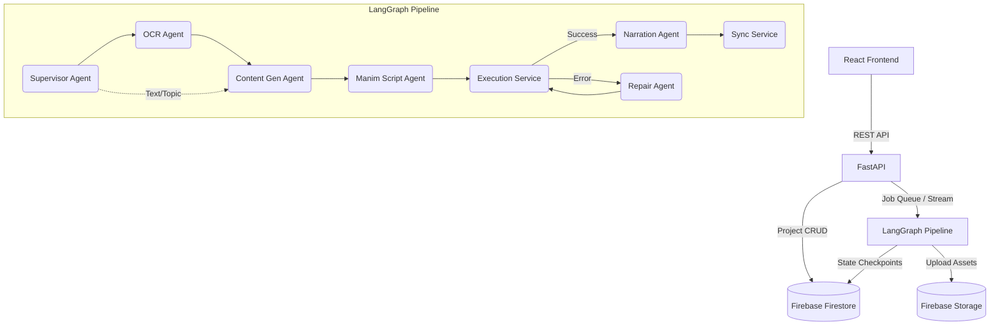

# Architecture Overview

The EduVideo Platform follows a modular, agentic architecture. The backend is built with FastAPI and LangGraph, separating the generation logic into distinct deterministic services and non-deterministic LLM agents.

## System Diagram

## Component Roles

### Agents (LLM-driven)
- **Supervisor**: Validates input, sets routing flags.
- **OCR Agent**: Uses Tesseract/PyMuPDF to extract content (equations, code, text) from PDFs and images.
- **Content Generation Agent**: Gemini 1.5 Pro. Produces a complete `LessonPlan` (Pydantic model) containing the storyboard, learning objectives, and animation parameters.
- **Manim Script Agent**: Gemini 1.5 Pro. Generates valid Python code for Manim CE based on the storyboard.
- **Repair Agent**: Gemini 1.5 Pro (Low Temp). Reads Manim execution tracebacks and surgically patches the script. Keeps track of previous errors to avoid looping.
- **Narration Agent**: Gemini 1.5 Flash. Refines the text into a teacher's voice and generates timestamps.

### Services (Deterministic)
- **Manim Execution Service**: Subprocess runner. Executes `manim` commands with timeouts and parses `stderr` for exceptions.
- **TTS Service**: Generates speech audio using `edge-tts` (or `gtts` fallback).
- **Synchronization Service**: Uses `FFmpeg` to stitch the final MP4 with synchronized audio and video streams.
- **Storage Service**: Handles upload/download to Firebase Storage and generates signed URLs.

## Persistence Layer

- **Firestore**: Used as a NoSQL document database.
  - `projects`: Contains metadata and input definitions.
  - `jobs`: Contains execution state, logs, and progress.
  - `videos`: Contains final output URLs and metrics.
  - `checkpoints`: Used by LangGraph to persist graph state across nodes (handled by custom `FirebaseCheckpointer`).
